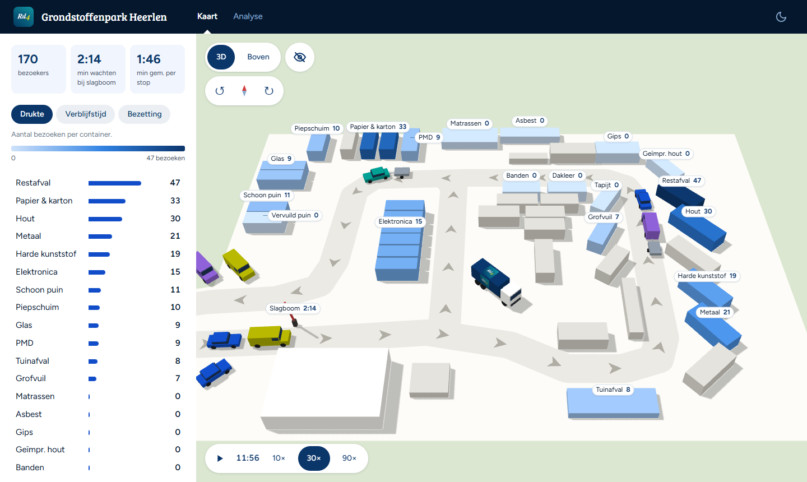
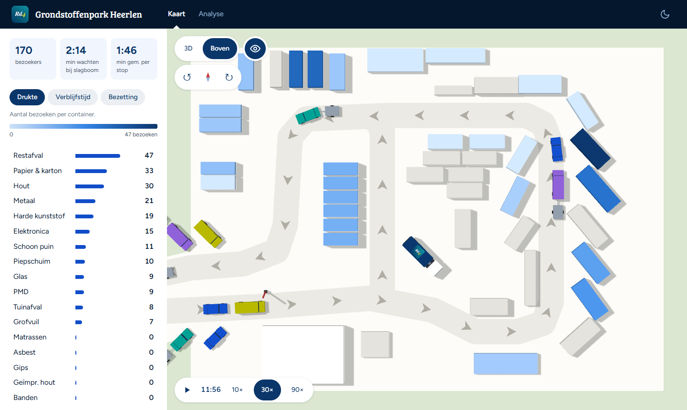
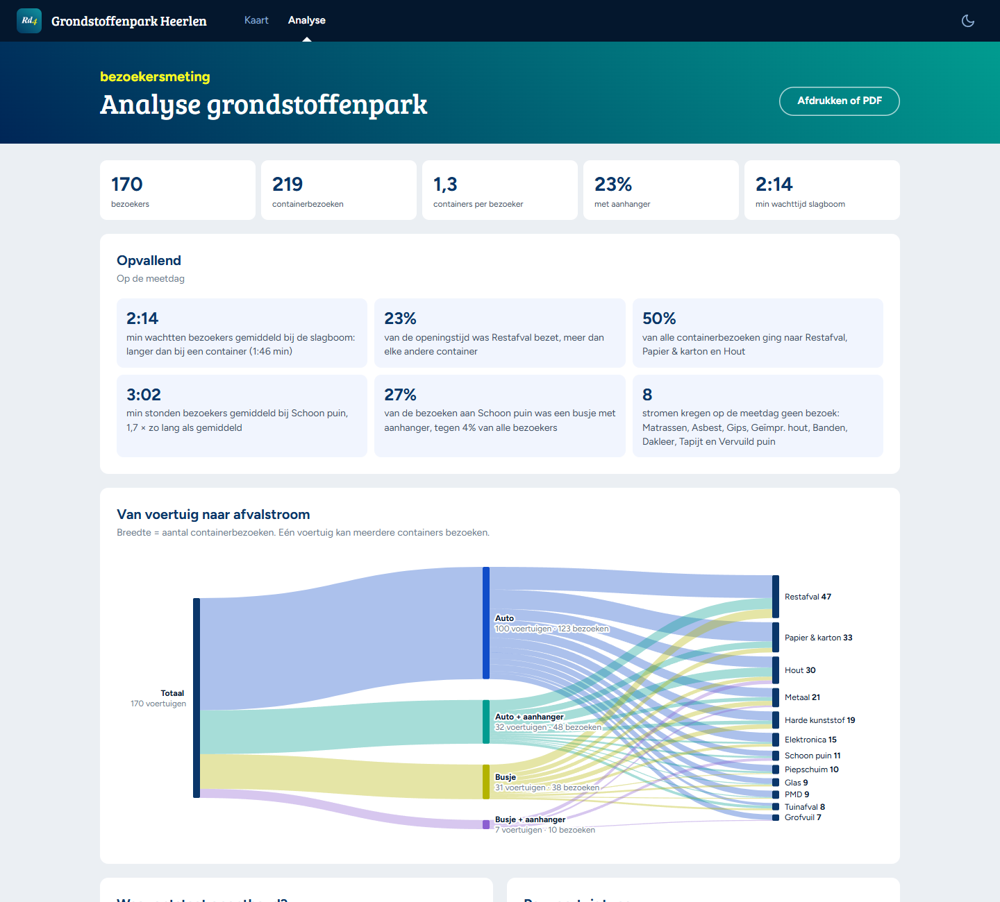
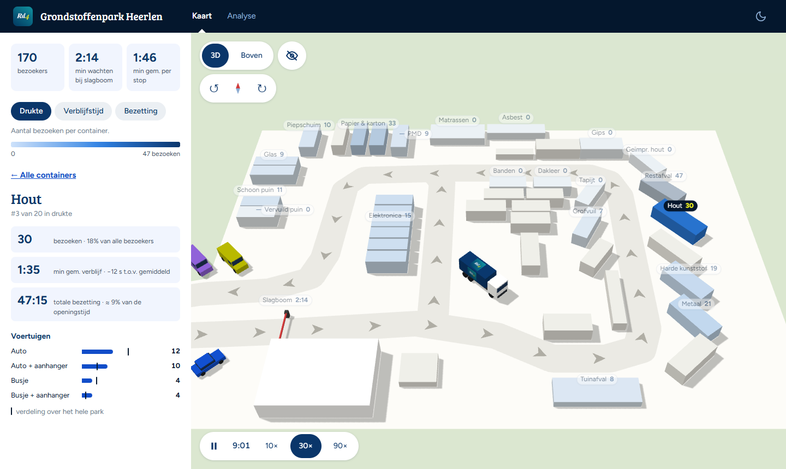
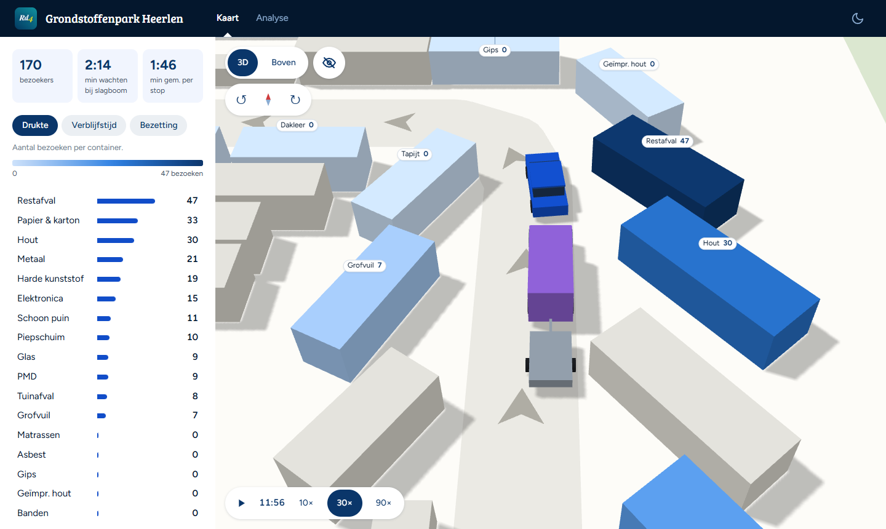

# Rd4 Grondstoffenpark Heerlen

Interactieve visualisatie van een bezoekersmeting op het Rd4 Grondstoffenpark in Heerlen: een 3D-kaart van het park, een analyse van de meetdag en een simulatie van een hele dag. Er zit ook een klein spel in voor medewerkers.

**Bekijken:** [senna88m.github.io/rd4-grondstoffenpark](https://senna88m.github.io/rd4-grondstoffenpark/)

> Studentenproject; geen officiële website van Rd4.

## De meetdag

Alles is gebaseerd op één meetdag op het park:

| | |
|---|---|
| Bezoekers | 170 voertuigen: 100 auto's, 32 auto's met aanhanger, 31 busjes, 7 busjes met aanhanger |
| Containerbezoeken | 219, dus gemiddeld 1,3 container per bezoeker |
| Per container | aantal bezoeken, gemiddelde verblijfstijd en welke voertuigtypen er kwamen |
| Slagboom | gemiddeld 2:14 min wachten |
| Openingstijden | ma t/m vr 9:00–17:30 ([rd4.nl](https://rd4.nl/grondstoffenparken/grondstoffenpark-heerlen)) |

De plattegrond (terrein, rijroute, gebouw, slagboom en alle containers) is nagetekend van een luchtfoto, op schaal: 1 pixel is ongeveer 7,5 cm.

## Voor medewerkers op het park

De kaart is gemaakt om snel te zien waar het druk is, ook op een scherm in het park.

- **Bovenaanzicht als plattegrond.** Met *Boven* zie je het park zoals op de luchtfoto: plat, recht van boven, en zonder te kantelen.
- **Kleuren als een warmtekaart.** Eén blauwe schaal over alle containers: licht is rustig, donkerblauw is druk. Met het oog verberg je de namen, zodat alleen de kleuren overblijven en je in één oogopslag ziet waar het park onder druk staat.
- **Makkelijk zoomen en schuiven.** Met de muis, met je vingers (knijpen, en in het bovenaanzicht draaien met twee vingers) of met het toetsenbord. De kaart blijft altijd binnen het terrein.
- **Werkt met alleen een toetsenbord, of met een eigen bedieningspaneel (HMI) van 8 knoppen:**

| Knop | Toets | Wat hij doet |
|---|---|---|
| Volgende | Tab | naar de volgende groep: naam (Google Maps), tabbladen, thema, maatstaf, containerlijst, kaart, namen op de kaart, 3D/Boven, namen verbergen, zijbalk, draaien, volledig scherm, simulatie |
| Vorige | Shift+Tab | terug naar de vorige groep |
| ← ↑ → ↓ | pijltjes | binnen een groep kiezen (na de laatste weer de eerste); op de kaart schuiven; op de namen naar de dichtstbijzijnde container in die richting |
| OK | Enter | openen of kiezen |
| Terug | Esc | detail sluiten, terug naar het overzicht |

Je ziet altijd duidelijk waar je bent. Springt de keuze naar een container buiten beeld, dan schuift de kaart er vanzelf heen.

## Voor op kantoor

Voor wie de meting wil begrijpen of erover moet beslissen, is er de tab *Analyse*: duidelijke grafieken die rechtstreeks uit de meetdata worden getekend.

- **Kerncijfers** van de meetdag in één rij.
- **Opvallend:** zes bevindingen die uit de data worden berekend, zoals welke container het langst bezet was. Gaat een bevinding over een container of voertuigtype, dan opent een klik die op de kaart.
- **Van voertuig naar afvalstroom (Sankey-diagram):** hoe de 170 voertuigen zich over de afvalstromen verdelen. Hoe breder de band, hoe meer containerbezoeken.
- **Waar ontstaat oponthoud?** Bezoeken uitgezet tegen verblijfstijd: rechtsboven staan de stromen die het park het langst bezet houden.
- **Per voertuigtype:** aandeel bezoekers en containers per bezoek.
- **Alle stromen:** een tabel die je op elke kolom kunt sorteren, ook op *% van openingstijd*.
- **Afdrukken of PDF:** een nette, lichte versie voor een verslag of overleg.

Elk voertuigtype heeft overal dezelfde kleur, in de grafieken, op de kaart en in de simulatie. Zo herken je een type meteen terug.

## Kaart

- **Containers kleuren mee met de gekozen maatstaf.** Kies in de zijbalk:
  - *Drukte:* het aantal bezoeken;
  - *Verblijfstijd:* hoe lang iemand bij de container staat;
  - *Bezetting:* hoe lang er in totaal een voertuig stond, ook als deel van de openingstijd.

  Grijs zijn containers waarvan niet bekend is welke stroom erin gaat.
- **Aanwijzen en klikken.** Wijs je een container of naam aan, dan knippert hij rustig tussen licht- en donkerblauw. Een klik opent de details: bezoeken, verblijf vergeleken met gemiddeld, bezetting en welke voertuigen er kwamen.
- **Voertuigtypen.** Bij de ingang staat van elk type één voertuig, in zijn eigen kleur. Klik erop en je ziet waar dat type heen ging; de containers waar het niet kwam vervagen.
- **Slagboom.** Klik voor de wachttijd en de verdeling van de voertuigen.
- **Namen die elkaar niet bedekken.** De namen gaan elkaar vanzelf uit de weg; staat een naam niet recht boven zijn container, dan wijst een lijntje ernaar.
- **Draaien en licht/donker.** Draai met de knoppen, of zet met het kompas het noorden weer boven. Het donkere thema volgt je apparaat; met de knop rechtsboven kies je zelf, en dat wordt onthouden.
- **Meer kaart.** Met de knop rechtsonder (op een telefoon rechtsboven) vult de kaart het hele scherm. Op de computer klap je met de knop onder het oog de zijbalk in.
- **Route.** De naam linksboven opent het park in Google Maps.

## Simulatie

Onder op de kaart loopt een hele openingsdag, van 9:00 tot 17:30. Die begint vanzelf bij het openen. Met ▶/❚❚ pauzeer je, en je kiest het tempo: 10×, 30× (een dag in ongeveer 17 minuten) of 90×. Is de dag voorbij, dan begint de volgende.

**Wat je ziet:**

- Voertuigen rijden binnen, sluiten aan in de rij en wachten bij de slagboom, die opengaat als ze door mogen.
- Ze rijden de eenrichtingsroute en stoppen bij hun containers, op volgorde langs de route.
- Ze lossen **aan de kant waar hun container staat**, niet midden op de weg. Wie erachter komt, haalt aan de andere kant in.
- Staat er aan beide kanten iemand, zoals bij Hout en Grofvuil die tegenover elkaar staan, dan wacht je tot er een kant vrij is en rijdt daar langs.
- Is jouw container bezet, dan sluit je erachter aan, aan dezelfde kant, zodat de weg vrij blijft.
- Voertuigen rijden nooit door elkaar heen. Aanhangers knikken apart van de wagen de bocht om.

**Echt volgens de meting:**

- De verhouding tussen de voertuigtypen.
- Welke containers elk type bezocht, en hoe vaak.
- Het aantal containers per bezoeker (1,3).
- De gemiddelde verblijfstijd per container: elke dag precies het gemeten gemiddelde.
- De gemiddelde wachttijd bij de slagboom: 2:14, gerekend vanaf het aansluiten in de rij. Elke dag wordt de tijd per voertuig bij de slagboom zo afgesteld dat het gemiddelde precies klopt.

**Aangenomen,** omdat het niet gemeten is:

- hoe de bezoekers over de dag verdeeld zijn (redelijk gelijkmatig, iets drukker rond 11 en 15 uur);
- welke containers één bezoeker combineert;
- de spreiding rond de gemiddelde tijden;
- de snelheid: stapvoets, 10 km/h.

**Drukte.** Om te laten zien waar het park kan vastlopen, rijden er in de simulatie **anderhalf keer zoveel voertuigen** als op de meetdag: 255 per dag in plaats van 170. De verhoudingen blijven daarbij gelijk. Bij halve aantallen, zoals 46,5 busjes, valt de afronding elke dag anders uit, zodat het gemiddeld klopt. De opstoppingen ontstaan vooral bij Restafval, Hout en Grofvuil, en in de hoek bij Papier, PMD en Glas.

## Verder

- **Deelbare links:** `#hout` opent de kaart bij Hout, `#slagboom` de slagboom en `#analyse` de analyse.
- **Mobiel:** de hele site werkt op telefoon en tablet.
- **Offline en als app:** na één bezoek werkt de site ook zonder internet, en je kunt hem aan je startscherm toevoegen.
- **Licht voor de computer:**
  - De site tekent alleen als er iets verandert. Staat de kaart stil, of zit je op de analyse, dan gebruikt hij niets.
  - Tijdens de simulatie tekent hij hooguit zo'n 30 keer per seconde, en alleen als er iets bewogen heeft.
  - Kan de browser de videokaart niet gebruiken, dan tekent de site zonder schaduwen en start de simulatie niet vanzelf.
- **Toegankelijk:**
  - Wie op zijn apparaat *minder beweging* heeft ingesteld, ziet geen automatisch afspelende simulatie.
  - Knoppen hebben beschrijvende namen voor schermlezers.

## Hoe het gemaakt is

Er is geen framework gebruikt, alleen [three.js](https://github.com/mrdoob/three.js/tree/r128) (versie r128) voor de 3D-kaart. De rest, zoals de simulatie, de grafieken en het spel, is eigen JavaScript zonder bibliotheken.

| Bestand | Wat erin staat |
|---|---|
| `data.js` | de meetdata en de plattegrond |
| `script.js` | de 3D-kaart, camera, namen, zijbalk, thema en volledig scherm |
| `grafieken.js` | de analyse: Sankey, spreidingsdiagram, balken en tabel |
| `spel.js` | het spel *Lossen maar* |
| `sim.js` | de simulatie van een openingsdag |
| `omgeving.js` | de bomen en de straat rond het park |
| `offline.js` | zorgt dat de site ook zonder internet werkt |
| `style.css` | de opmaak, naar de huisstijl van rd4.nl |

**De camera** (kantelen, draaien, schuiven en zoomen) is [MapControls](https://threejs.org/docs/#examples/en/controls/MapControls) uit three.js, een variant van [OrbitControls](https://github.com/mrdoob/three.js/blob/r128/examples/js/controls/OrbitControls.js). Daaromheen zitten eigen toevoegingen: de twee standpunten (3D en Boven), de draaiknoppen, het kompas, draaien met twee vingers en de grens van het terrein. Een container aanklikken gaat met de [Raycaster](https://threejs.org/docs/#api/en/core/Raycaster), en de kaart tekent alleen als er iets verandert, zoals in [Rendering on demand](https://threejs.org/manual/#en/rendering-on-demand).

**De voertuigen** in de simulatie volgen de rijroute als één lange lijn: elk voertuig weet hoe ver het langs de route is en of het links, in het midden of rechts rijdt. Elke stap kijkt het hoeveel ruimte er voor hem is, remt als er iemand staat en gaat opzij om te lossen of in te halen. Dat is een eenvoudig [volgmodel](https://en.wikipedia.org/wiki/Microscopic_traffic_flow_model), in vaste stapjes van een kwart seconde ([Fix Your Timestep!](https://gafferongames.com/post/fix_your_timestep/)). Het dichtstbijzijnde punt op de route wordt gevonden met een projectie (het inproduct), zoals in de video's over *path following* hieronder.

**Rekenwerk voor de dag:**
- de aantallen worden verdeeld met de [methode van de grootste rest](https://en.wikipedia.org/wiki/Largest_remainder_method);
- volgordes worden gehusseld met [Fisher–Yates](https://en.wikipedia.org/wiki/Fisher%E2%80%93Yates_shuffle), met een vast zaadje ([mulberry32](https://gist.github.com/tommyettinger/46a874533244883189143505d203312c)) zodat een dag en de dagopdracht altijd hetzelfde uitvallen;
- de wachttijd bij de slagboom wordt afgesteld met [halveren](https://en.wikipedia.org/wiki/Bisection_method).

**Verder gebruikt:**
- de namen op de kaart worden geplaatst zoals bij [automatische labelplaatsing](https://en.wikipedia.org/wiki/Automatic_label_placement);
- de analyse gebruikt een [Sankey-diagram](https://en.wikipedia.org/wiki/Sankey_diagram);
- het toetsenbord werkt met *roving tabindex* uit de [WAI-ARIA-richtlijnen](https://www.w3.org/WAI/ARIA/apg/practices/keyboard-interface/);
- offline werkt met een [service worker](https://developer.mozilla.org/en-US/docs/Web/API/Service_Worker_API) (eerst het netwerk, zie [strategieën](https://developer.chrome.com/docs/workbox/caching-strategies-overview));
- volledig scherm gebruikt de [Fullscreen API](https://developer.mozilla.org/en-US/docs/Web/API/Fullscreen_API);
- het spel draait in een [dialog](https://developer.mozilla.org/en-US/docs/Web/HTML/Element/dialog), met slepen via [pointer events](https://developer.mozilla.org/en-US/docs/Web/API/Pointer_events) en animaties via de [Web Animations API](https://developer.mozilla.org/en-US/docs/Web/API/Web_Animations_API);
- de lettertypen zijn [Bree Serif](https://fonts.google.com/specimen/Bree+Serif) en [Figtree](https://fonts.google.com/specimen/Figtree).

**Video's over dezelfde onderwerpen:**

- Camera: [Your Guide To The Orbit Controls Module In Three.js](https://www.youtube.com/watch?v=Nxd9L6X8quo) (Wael Yasmina) en [Three.js Cameras Explained](https://www.youtube.com/watch?v=FwcXultcBl4) (SimonDev)
- Klikken op iets in 3D: [Three.js Raycasting Tutorial for Beginners](https://www.youtube.com/watch?v=QATefHrO4kg) (Dan Greenheck)
- Voertuigen die een route volgen: [Autonomous Steering Agents](https://www.youtube.com/watch?v=P_xJMH8VvAE), [Vector Dot Product (Scalar Projection)](https://www.youtube.com/watch?v=DHPfoqiE4yQ) en [Path Following](https://www.youtube.com/watch?v=rlZYT-uvmGQ) (The Coding Train)
- Waarom een rij vastloopt als iedereen op zijn voorganger wacht: [Shockwave traffic jams recreated for first time](https://www.youtube.com/watch?v=Suugn-p5C1M) (New Scientist) en [Traffic Has a Perfect Solution. Humans Are the Problem.](https://www.youtube.com/watch?v=iHzzSao6ypE) (CGP Grey)
